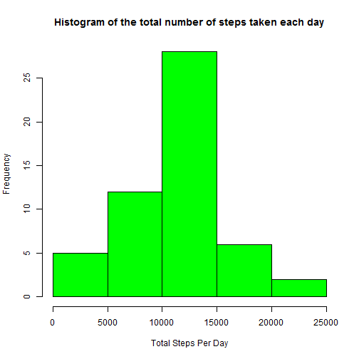
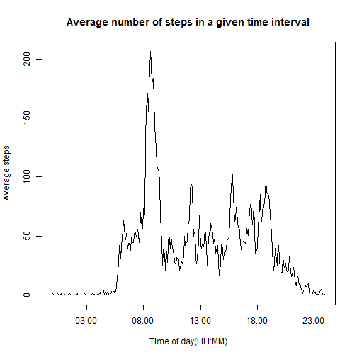
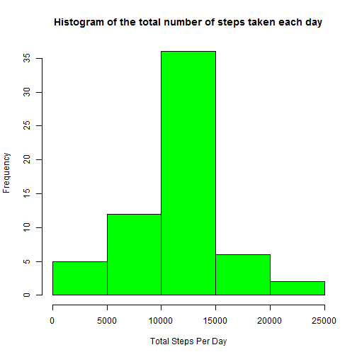
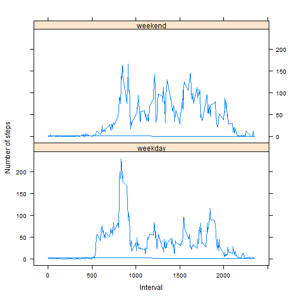

## Loading and preprocessing the data

```r
#Read data into dataframe df. activity.csv file must be in the working directory (Question part 1)
df<-read.csv("activity.csv")

#Remove NA values from data frame df into data frame df_noNA (Question part 2)
df_noNA<-df[complete.cases(df),]
```

## What is mean total number of steps taken per day?

```r
#Convert data frame df_noNA into a data table dt_noNA
library(data.table)
dt_noNA<-as.data.table(df_noNA)

#Compute the total number of steps for each day (Question part 1)
totalStepsPerDay<-dt_noNA[,sum(steps),by=date]

#Rename columns appropriately
setnames(totalStepsPerDay,"V1","totalStepsDay")

#Create a Histogram of the total number of steps per day (Question part 2)
hist(totalStepsPerDay$totalStepsDay, col="green",xlab="Total Steps Per Day",main="Histogram of the total number of steps taken each day")
```

 

```r
#Compute mean and median of total steps taken (Question part 3)
mean<-mean(totalStepsPerDay$totalStepsDay)  
median<-median(totalStepsPerDay$totalStepsDay)

print(sprintf("Mean of the total steps taken per day is : %f ", mean))
```

```
## [1] "Mean of the total steps taken per day is : 10766.188679 "
```

```r
print(sprintf("Median of the total steps taken per day is: %f ", median))
```

```
## [1] "Median of the total steps taken per day is: 10765.000000 "
```

## What is the average daily activity pattern?


```r
# Convert data frame df into a data table dt
library(data.table)
dt<-as.data.table(df)

# Compute the average number of steps for each interval
avgStepsPerInterval<-tapply(dt$steps,dt$interval,mean,na.rm=TRUE)

library(plyr)

# The next few steps before plotting the graph is to handle the gap in intervals (i.e. jump from 55 to 100 in each hour). The logic smoothes 
# out that difference and makes the interval continuous

# Function to create a new character vector that removes the 45 minute stretch in interval
intToHHMM <- function (i) { sprintf("%02d:%02d", i %/% 100, i %% 100)}

# Create a new column in data table to hold the continuous intervals
dt<-dt[,intToHHMM:=intToHHMM(interval)]

#Retrieve distinct time intervals into vector
intervals<-unique(dt$intToHHMM)

#Convert continuous interval to Time format
time<-strptime(intervals,format="%H:%M")

#Create a time series plot - continuous interval on the x-axis vs the average number of steps on the y-axis (Question part 1)
plot(time,avgStepsPerInterval,type="l",xlab="Time of day(HH:MM)",ylab="Average steps",main="Average number of steps in a given time interval")
```

 

```r
#Compute the maximum number of average steps 
dt<-dt[,avg:=mean(steps,na.rm=TRUE),by=interval]
maxSteps<-max(dt$avg)

#Retrieve the interval corresponding to the maximum number of steps (Question part 2)
maxStepsIntervaldt<-as.data.frame(dt[dt$avg==maxSteps,])
maxStepsInterval<-unique(maxStepsIntervaldt$interval)

#Interval corresponding to maximum average steps is:
maxStepsInterval
```

```
## [1] 835
```
The interval corresponding to the maximum average steps is 835

## Imputing missing values

```r
#Obtain na values from data frame df into data frame df_NA
df_NA<-df[!complete.cases(df),]

#Compute total number of missing values in the dataset (Question Part 1)
missingCount<-nrow(df_NA)
print(sprintf("The total number of missing values in the dataset is: %i ", missingCount))
```

```
## [1] "The total number of missing values in the dataset is: 2304 "
```

```r
#Create a data table
library(data.table)
dt_NA<-as.data.table(df_NA)
dt_noNA<-as.data.table(df_noNA)

#Strategy for imputing missing values - Compute mean steps per interval to substitute for NA values
library(data.table)
dt<-as.data.table(df)
meanStepsPerInterval<-dt[,mean(steps,na.rm=TRUE),by=interval]
dfmeanStepsPerInterval<-as.data.frame(meanStepsPerInterval)

#Create a new data frame by substituting mean steps per interval for NA (Question Part 2)
dfres<-data.frame(steps=dfmeanStepsPerInterval[match(dfmeanStepsPerInterval$interval,dt_NA$interval),2],date=dt_NA$date,interval=dt_NA$interval)

#Combine non NA and substituted NA tables
dfnew<-rbind(dfres,dt_noNA)

#Order the data table. This table is equivalent to the original dataset but with missing values filled in
#with the mean number of steps in each time interval (Question Part 3)
dfnewOrdered<-dfnew[order(date,interval)]
dtnewOrdered<-as.data.table(dfnewOrdered)

#Compute the total number of steps for each day
totalStepsPerDay<-dtnewOrdered[,sum(steps),by=date]

#Rename columns appropriately
setnames(totalStepsPerDay,"V1","totalStepsPerDay")

#Create a Histogram of the total number of steps per day (Question part 4)
hist(totalStepsPerDay$totalStepsPerDay, col="green",xlab="Total Steps Per Day",main="Histogram of the total number of steps taken each day")
```

 

```r
#Compute mean and median of total steps taken
mean<-mean(totalStepsPerDay$totalStepsPerDay)
median<-median(totalStepsPerDay$totalStepsPerDay)

print(sprintf("Mean of the total steps taken per day is : %f ", mean))
```

```
## [1] "Mean of the total steps taken per day is : 10766.188679 "
```

```r
print(sprintf("Median of the total steps taken per day is: %f ", median))
```

```
## [1] "Median of the total steps taken per day is: 10766.188679 "
```

```r
print(sprintf("Therefore the impact of imputing the missing data on the estimates of the total daily number of steps is that the median value has shifted to be now equal to the mean")) 
```

```
## [1] "Therefore the impact of imputing the missing data on the estimates of the total daily number of steps is that the median value has shifted to be now equal to the mean"
```

## Are there differences in activity patterns between weekdays and weekends?

```r
#Function to return whether a day falls on a weekday or weekend
dayType = function(x){
        if(x %in% c('Saturday', 'Sunday')){
                return('weekend')
        }
        return('weekday')
}


#Add a new column for weekday name
dtnewOrdered$day = weekdays(as.Date(dtnewOrdered$date))

#Add factor variable to determine if day is a weekday or weekend (Question part 1)
dtnewOrdered$daytype = as.factor(apply(as.matrix(dtnewOrdered$day), 1, dayType))

#Create a new column to hold the mean of the number of steps for given daytype & interval
dtnewOrdered<-dtnewOrdered[,mean:=mean(steps),by=list(interval,daytype)]

library(datasets)
library(lattice)

xyplot(dtnewOrdered$mean~dtnewOrdered$interval|daytype,data=dtnewOrdered,layout=c(1,2),type="l",ylab="Number of steps",xlab="Interval")
```

 


